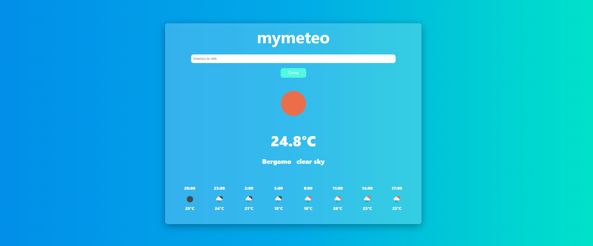

# Progetto Web App Meteo

## Descrizione del progetto

Il progetto "Web App Meteo" è un semplice sito web che mostra le previsioni meteorologiche utilizzando dati di API esterne. L'obiettivo principale è offrire una soluzione accessibile e visivamente piacevole per consultare il meteo in modo semplice e intuitivo.

## Caratteristiche principali

- **Interfaccia utente semplice e pulita**: Utilizziamo un design minimalista per garantire che l'utente possa concentrarsi sulle informazioni importanti.
- **Dati aggiornati in tempo reale**: Le previsioni meteorologiche sono ottenute tramite API, assicurando dati accurati e aggiornati.
- **Supporto per più località**: L'app permette di cercare il meteo per diverse città, facilitando la navigazione per l'utente.
- **Socal storage implementato**: L'app memorizza l' ultima località cercata, in modo che l'utente non debba ricercare ogni volta la stessa località.

## Tecnologie utilizzate

- **HTML/CSS**: Per la struttura e lo stile della web app.
- **JavaScript**: Per le richieste API e interazioni con l'utente.
- **API di meteo**: Utilizziamo un'API pubblica per ottenere i dati meteorologici (ad esempio, OpenWeatherMap).

## Come utilizzare il progetto

- Clona questo repository sul tuo computer (le API sono già inserite perciò non devi fare alcun passaggio aggiuntivo).
- Apri il file `index.html` nel browser.
- Inserisci il nome della città per la quale vuoi vedere le previsioni meteorologiche.
